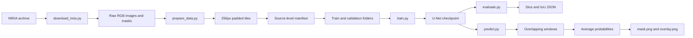
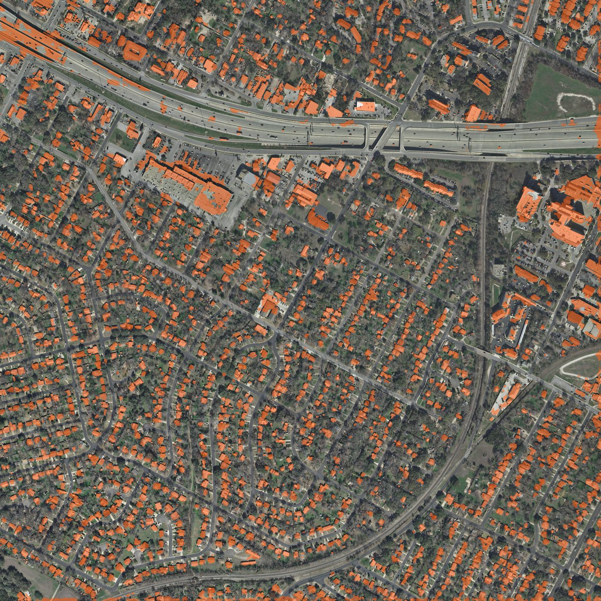
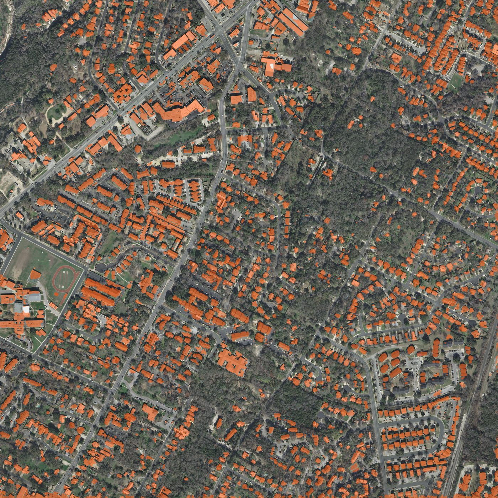
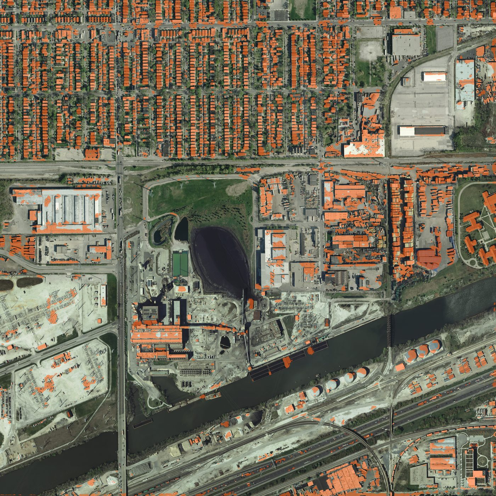

# Aerial Building Segmentation


**A reproducible PyTorch pipeline that turns aerial RGB imagery into pixel-level building footprint masks.**

The pipeline prepares INRIA imagery, trains a compact U-Net, evaluates it on source-held-out geography, and runs overlap-aware inference on full images. The implementation covers data validation, leakage-aware splitting, checkpointed training, segmentation metrics, and deployment-style prediction.

## Project Summary

The system solves a geospatial segmentation problem: given an aerial image, identify which pixels belong to buildings. Large orthophotos are converted into fixed-size, padded tiles for training. Tiles are split by source image rather than randomly, so neighboring pixels from one scene cannot appear in both training and validation. At inference time, overlapping window predictions are averaged before thresholding to reduce tile-boundary seams.

**Technologies:** Python, PyTorch, NumPy, Pillow, pytest, optional `segmentation-models-pytorch`, and GitHub Actions.

**What it covers:** the complete data-to-model-to-inference workflow, the local U-Net implementation, the optional ImageNet-pretrained ResNet-34 encoder, source-level split design, BCE-plus-Dice training, Dice/IoU evaluation, and full-image mask generation.

## Highlights

- Converts large labeled aerial images into 256x256 overlapping tiles.
- Uses source-image-level train/validation splitting to reduce spatial leakage.
- Trains a compact U-Net from scratch or an optional ResNet-34 U-Net with ImageNet weights.
- Combines `BCEWithLogitsLoss` with a soft Dice loss for sparse foreground regions.
- Selects the best checkpoint by validation IoU and records its configuration.
- Reconstructs full-image predictions by averaging overlapping probabilities.
- Runs on CPU by default when CUDA is unavailable.
- Includes lightweight tests for model shape, metrics, tiling, split integrity, inference stitching, and overlays.
- Includes a bounded CPU smoke-run artifact for review without claiming a production benchmark.

## Architecture and Workflow



### Data flow

```text
Source image + ground-truth mask
        |
RGB conversion, mask binarisation, zero-padded overlapping tiles
        |
Source-level train/validation split
        |
Normalised tensors with training flips
        |
U-Net logits
        |
BCE-with-logits + soft Dice optimisation
        |
Best checkpoint selected by validation IoU
        |
Sliding-window inference and probability stitching
        |
Binary building mask and visual overlay
```

## Project Structure

```text
.
- README.md                    # Project guide
- analysis.md                  # Local notes, not committed
- pyproject.toml               # Package metadata and dependencies
- assets/                      # Reviewable qualitative overlays
- reports/                     # Recorded evaluation summaries
- scripts/
  - download_inria.py          # Copy a capped official dataset subset
  - prepare_data.py            # Tile data and create source-level splits
  - train.py                   # Train and checkpoint a model
  - evaluate.py                # Evaluate held-out tiles
  - predict.py                 # Predict a complete RGB image
- src/aerial_building_seg/
  - data.py                    # Tiling, pairing, datasets, manifests
  - inference.py               # Sliding windows and overlays
  - metrics.py                 # Binary Dice and IoU
  - model.py                   # U-Net and checkpoint loading
- tests/test_pipeline.py       # Fast tests without INRIA downloads
```

Generated data and model weights are intentionally excluded from version control. See `.gitignore` and the dataset notes below.

## Dataset

The project uses the [INRIA Aerial Image Labeling dataset](https://project.inria.fr/aerialimagelabeling/), which provides 0.3 m orthorectified RGB imagery and binary building/not-building labels. The repository does not redistribute the imagery. Download and use it according to the official dataset terms.

The scripts expect an extracted source with this layout:

```text
inria/
train/
images/
gt/
```

The official archive is split into five 7-Zip parts. On Windows, keep all parts in one directory, extract `aerialimagelabeling.7z.001` with 7-Zip, and then extract the resulting dataset archive. On Linux, the equivalent commands are `7z x aerialimagelabeling.7z.001` and `unzip NEW2-AerialImageDataset.zip`.

Copy a bounded working set into the project layout:

```powershell
python scripts/download_inria.py --source C:\path\to\inria --max-images 20
```

The path above is an example only; use a local path appropriate to your machine.

## Installation

Requirements:

- Python 3.10 or newer.
- CPU is supported; CUDA is selected automatically when available.
- The INRIA dataset for training/evaluation.
- An existing checkpoint for inference-only demonstrations.

Install the baseline and development tools:

```powershell
python -m pip install -e ".[dev]"
```

Install the optional transfer-learning dependency as well when using `--pretrained`:

```powershell
python -m pip install -e ".[dev,transfer]"
```

The `transfer` extra installs `segmentation-models-pytorch`, which supplies the ImageNet-pretrained ResNet-34 U-Net encoder path.

## Quickstart

After the INRIA subset has been copied:

```powershell
python scripts/prepare_data.py `
  --images data/raw/inria/images `
  --masks data/raw/inria/masks `
  --output data/tiles

python scripts/train.py `
  --data data/tiles `
  --run-dir runs/baseline `
  --epochs 20 `
  --seed 42

python scripts/evaluate.py `
  --checkpoint runs/baseline/best.pt `
  --data data/tiles/val `
  --output reports/baseline.json

python scripts/predict.py `
  --checkpoint runs/baseline/best.pt `
  --image data/raw/inria/images/austin1.tif `
  --output runs/austin1
```

The prediction command writes:

```text
runs/austin1/mask.png       # 0/255 binary building mask
runs/austin1/overlay.png    # RGB input with orange predictions
```

### Optional transfer-learning run

```powershell
python scripts/train.py `
  --data data/tiles `
  --run-dir runs/resnet34 `
  --pretrained `
  --epochs 15 `
  --seed 42
```

The pretrained model uses a U-Net supplied by `segmentation-models-pytorch` with a ResNet-34 encoder initialized from ImageNet weights. The baseline model does not require this optional dependency.

## Configuration

The command-line scripts keep configuration explicit and portable. Important defaults are:

| Option | Default | Used by | Purpose |
| --- | ---: | --- | --- |
| `--tile-size` | `256` | prepare, predict | Model/window size in pixels |
| `--stride` | `192` | prepare, predict | Distance between tile origins |
| `--val-fraction` | `0.2` | prepare | Fraction of source images held out |
| `--epochs` | `20` | train | Training passes |
| `--batch-size` | `4` | train | Images per batch |
| `--learning-rate` | `3e-4` | train | AdamW learning rate |
| `--base-channels` | `32` | train | Width of the scratch U-Net |
| `--seed` | `42` | train | Python/NumPy/PyTorch seed |
| `--threshold` | `0.5` | predict | Probability-to-mask cutoff |
| `--device` | CUDA if available, else CPU | all model scripts | Execution device |

The training checkpoint stores the model state, command-line configuration, and best-epoch metrics. Evaluation and prediction use that stored configuration to rebuild the correct scratch or pretrained architecture.

## Evaluation and Recorded Result

`pretrained_smoke` is one CPU smoke run, not a tuned model. Training and the later full-folder evaluation used different validation sets, so they are reported separately.

| Stage | What was scored | Dice | IoU |
| --- | --- | ---: | ---: |
| Checkpoint selection | First 64 validation tiles, 1 epoch, 256 training tiles | 0.5471 | 0.4108 |
| Full validation folder | 2,187 tiles, same checkpoint | 0.5524 | 0.4071 |

Setup: 12 INRIA source images, U-Net with an ImageNet ResNet-34 encoder, CPU. The checkpoint was chosen on the 64-tile cap. The 2,187-tile scores come from `scripts/evaluate.py` on the full validation folder. Both numbers are in [`reports/evaluation.json`](reports/evaluation.json). The one-epoch training history stays in the local run directory and is not committed.

The metrics are binary pixel Dice and Intersection over Union. Empty prediction/target regions receive an explicit epsilon-stabilised score in `metrics.py`. Scores are computed per batch and then averaged with equal weight per batch, so a short last batch counts the same as a full batch. A production evaluation should also report one global pixel count.

### Qualitative examples

These committed overlays show the output format of the prediction workflow without requiring a new training run.





## Tests and Continuous Integration

Run the fast local test suite:

```powershell
python -m pytest -q
```

The tests create tiny synthetic images and cover:

- U-Net input/output shape,
- perfect Dice/IoU behavior,
- invalid metric thresholds,
- paired tiling and dataset tensor layout,
- source-level split isolation,
- overlap-aware inference,
- overlay image creation.

GitHub Actions installs the development dependencies and runs the test suite on pushes and pull requests. CI does not download the dataset or run model training.

## Technical Highlights

- Designed a complete data -> preprocessing -> model -> training -> evaluation -> inference workflow.
- Implemented a compact encoder-decoder U-Net with skip connections and shape alignment.
- Added source-image-level splitting to prevent adjacent aerial tiles crossing the validation boundary.
- Implemented zero-padded tiling and overlapping probability stitching for large images.
- Combined BCE-with-logits and soft Dice objectives for binary foreground segmentation.
- Added portable checkpoint reconstruction for both scratch and optional transfer-learning models.
- Added reproducible Python, NumPy, and PyTorch seeding to the training entry point.
- Added focused tests around deterministic preprocessing and critical inference behavior.
- Kept CPU-compatible defaults while supporting CUDA when available.

## Walkthrough

1. **Start here:** Show this README and explain that the project extracts building footprints from aerial RGB imagery.
2. **Explain the data decision:** Open `src/aerial_building_seg/data.py` and show why tiles are split by source image rather than randomly.
3. **Explain the model:** Open `src/aerial_building_seg/model.py` and trace the encoder, skip connections, decoder, and one-channel logits.
4. **Run the pipeline:** Use the preparation, training, evaluation, and prediction commands above. For a short live demo, use a small `--max-train-tiles`, `--max-val-tiles`, and one epoch.
5. **Show the output:** Open `mask.png` and `overlay.png`, then point to the recorded Dice/IoU report.
6. **Explain the technical decision:** Show `sliding_window_predict` and explain why overlapping probabilities are averaged before thresholding.
7. **Discuss limitations:** Be explicit that the recorded result is a one-epoch CPU smoke run, that GIS metadata/vector export is not implemented, and that validation aggregation can be made more rigorous.
8. **Discuss improvements:** Mention threshold calibration, stronger augmentation, global metric aggregation, batched inference, mixed precision, and georeferenced outputs.

## Limitations and Future Improvements

Current limitations that are visible in the implementation:

- The recorded experiment is intentionally small and should not be treated as a final benchmark.
- The current output is a raster PNG, not a georeferenced GeoTIFF or polygon layer.
- Augmentation is limited to synchronized horizontal and vertical flips.
- The default threshold is 0.5 and is not calibrated on validation data.
- Validation metrics are averaged over batches rather than accumulated from a global confusion matrix.
- Sliding-window inference processes one tile at a time.
- There is no distributed training, mixed precision, experiment tracker, or model-serving API.

Possible next steps are a fixed geographic test split, per-city and global metrics across multiple seeds, validation threshold tuning, stronger augmentation, batched inference windows, mixed precision, CRS/affine metadata, and georeferenced mask or polygon export.

## Troubleshooting

### `No mask found`

Check that image and mask stems match and that the files are inside the expected directories. The loader accepts `.jpg`, `.jpeg`, `.png`, `.tif`, and `.tiff`.

### `Image/mask size mismatch`

The paired image and mask must have the same height and width before tiling. Check the source extraction and mask conversion.

### `Install the transfer extra...`

Install the optional dependency with `python -m pip install -e ".[transfer]"`, or omit `--pretrained` to use the local compact U-Net.

### CUDA or memory problems

Use `--device cpu`, reduce `--batch-size`, reduce `--base-channels`, or cap the number of tiles. For inference, increase stride or reduce tile size only after considering the effect on context and output quality.

### Missing checkpoint

Training creates `<run-dir>/best.pt`. Prediction and evaluation require that file and use the architecture settings stored inside it. The repository does not require model weights to be committed.

## Project Information

- **Project:** `aerial-building-seg`
- **Purpose:** Building footprint segmentation from aerial imagery
- **License:** MIT for the project code; dataset terms remain those of INRIA and its providers
- **Author:** Not specified in the repository metadata.

## Citation

```bibtex
@inproceedings{maggiori2017dataset,
  title={Can Semantic Labeling Methods Generalize to Any City? The Inria Aerial Image Labeling Benchmark},
  author={Maggiori, Emmanuel and Tarabalka, Yuliya and Charpiat, Guillaume and Alliez, Pierre},
  booktitle={IEEE International Geoscience and Remote Sensing Symposium (IGARSS)},
  year={2017}
}
```
